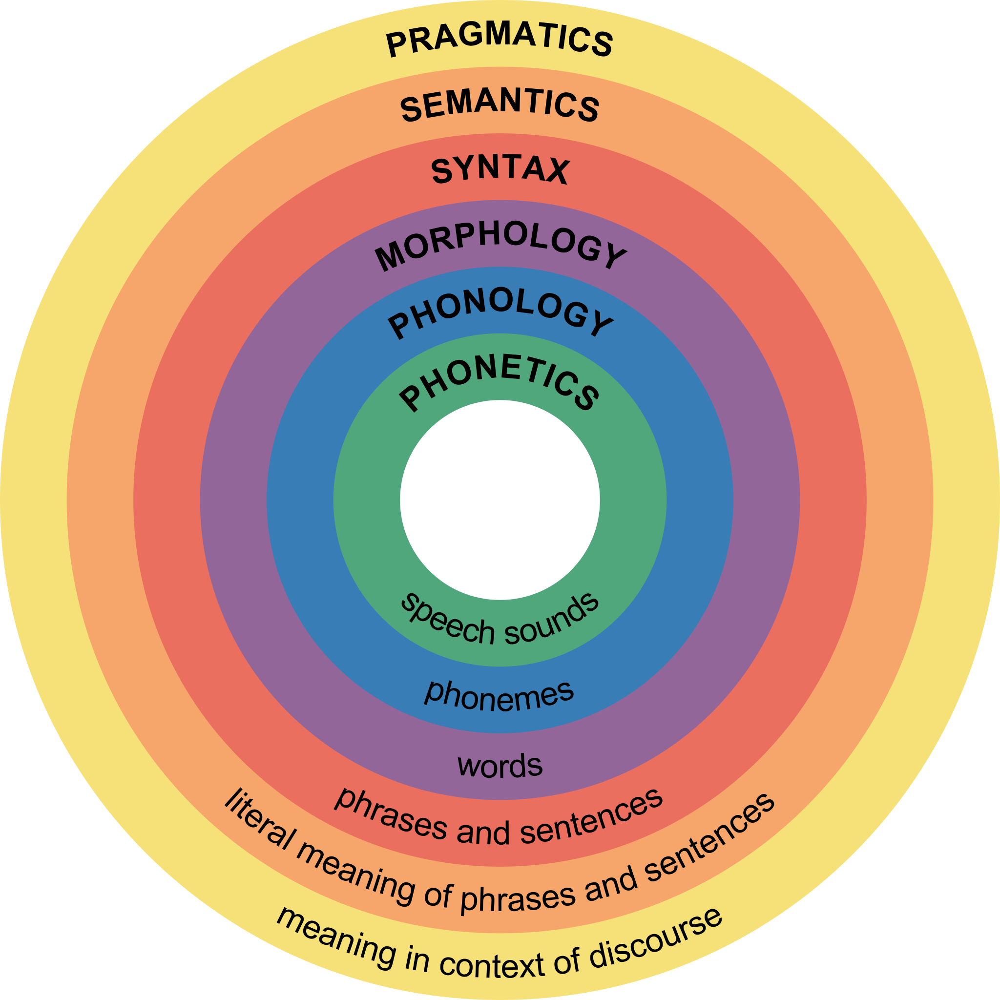
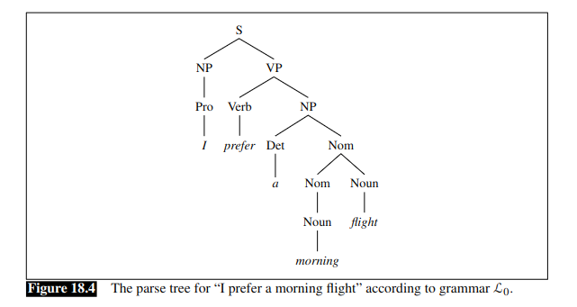
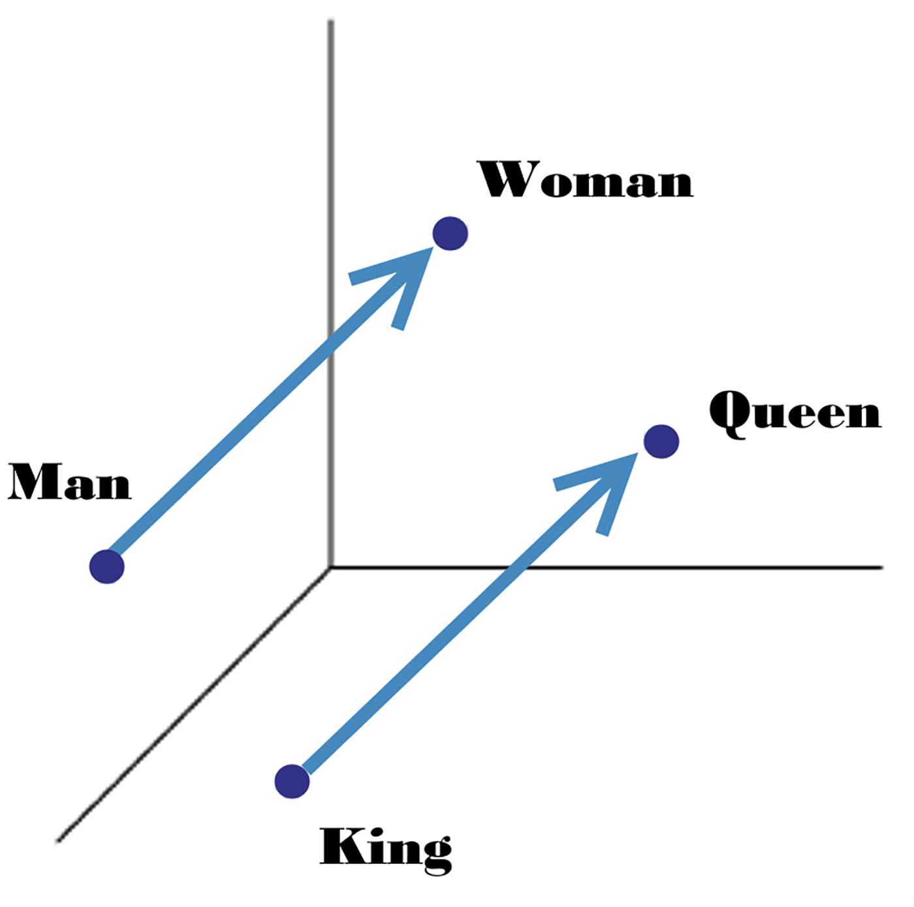

# Introduction to Linguistics

Victoria Handford  
September 2, 2024  
(Adapated from IN1140: Lecture 2)  

> **Linguistics** is the scientific study of language.

Some central questions:
* What do different languages have in common?
* How does language work?
* How do languages change over time?
* How do people acquire language?
* How is language stored in the brain?
* **What does it mean to know a language?**

Linguistics consists of several areas:  

## Phonetics and Phonology

* **<u>Phonetics</u>**: the study of speech sound; how we make and perceive sounds  
* **<u>Phonology</u>**: the study of *phonemes*; how languages combine sounds

Ex: Automatic Speech Recognition (ASR)  
([Doing Terrible things to Speech Recognition Software, Will Styler](https://wstyler.ucsd.edu/posts/terrible_speech_recognition.html))  

"I'm going to take a /wɑk/ from the chinese restaurant" &rarr; *walk* or *wok*? 

## Morphology
The study of words; how are words structured, inflected, created, and split into parts of speech

Ex: Part-of-Speech (POS) Tagging  

|Word |POS-tag|
|-----|-------|
| The   | DT  |
| cats  | NNS |
| can   | MD / VB  |
| fish  | VB / NN  |

## Syntax
The study of phrases and sentence; how we combine words into phrases and phrases into sentences

Ex) Syntactic Parsing (Jurafsky and Martin, pp. 389)

## Semantics
The study of the literal meaning of phrases and sentences

Ex: Semantic Relationships

## Pragmatics
The study of meaning in context

Ex: Speech Acts

"I would like an apple" vs. "Could you hand me an apple?"

